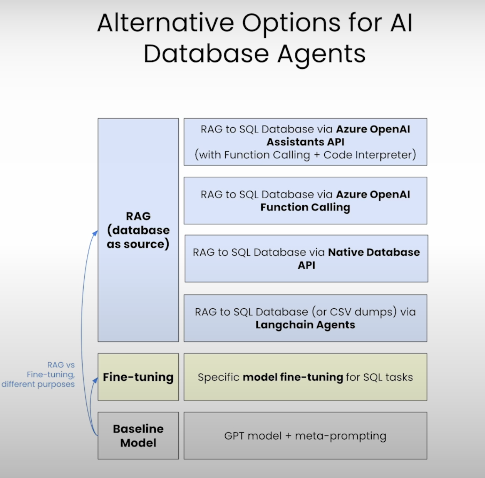

# Building Your Own Database Agent


This repository contains my notes and code for the [Building Your Own Database Agent](https://www.deeplearning.ai/short-courses/building-your-own-database-agent/) offered by DeepLearning AI.

## Main Topics Covered
- []
- []
- []
- []


## Langchain Data Agents Summary

TBD

**Main Features:**

1. []
2. []
3. []
5. []



## How to use this repo

To get started, please follow the instructions below:

1. Clone the repository to your local machine:
```
git clone https://github.com/martomor/database_agent.git
```

2. Install Python 3.11.9 on your system. You can use either pyenv or conda to manage your Python versions. Here are the steps for each option:

    - Using pyenv:
      - Install pyenv by following the instructions [here](https://github.com/pyenv/pyenv#installation).
      - Once pyenv is installed, run the following command to install Python 3.11.9:
         ```
         pyenv install 3.11.9
         ```
      - Set Python 3.11.9 as the global version by running:
         ```
         pyenv global 3.11.9
         ```

    - Using conda:
      - Install conda by following the instructions [here](https://docs.conda.io/projects/conda/en/latest/user-guide/install/index.html).
      - Create a new conda environment with Python 3.11.9 by running:
         ```
         conda create -n dbagent python=3.11.9
         ```
      - Activate the environment by running:
         ```
         conda activate dbagent
         ```

3. Install the required dependencies using either pip or Poetry. Here are the steps for each option:

    - Using pip:
      - Navigate to the project directory:
         ```
         cd database_agent
         ```
      - Install the dependencies:
         ```
         pip install -r requirements.txt
         ```

    - Using Poetry:
      - Navigate to the project directory:
         ```
         cd database_agent
         ```
      - Install Poetry by following the instructions [here](https://python-poetry.org/docs/#installation).
      - Install the dependencies:
         ```
         poetry install
         ```

